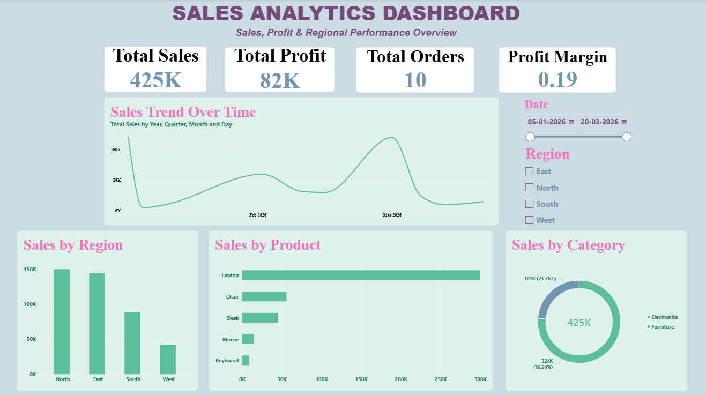

# Power BI Sales Analytics Dashboard

An interactive Sales Analytics Dashboard built using Microsoft Power BI to analyze sales, profit, orders, products, categories, and regional performance.

## 📌 Project Overview

This project analyzes sales transaction data and converts raw data into meaningful business insights using Microsoft Power BI.

The dashboard provides a consolidated view of key business performance metrics and helps analyze sales, profit, product, category, and regional trends.

## 🎯 Objectives

- Analyze overall sales and profit performance
- Track total orders and quantity sold
- Analyze sales and profit by product
- Compare category-wise sales performance
- Analyze sales performance across different regions
- Track sales trends over time
- Calculate and monitor profit margin
- Present insights through an interactive Power BI dashboard

## 🛠️ Tools & Technologies

- Microsoft Power BI Desktop
- Power Query
- DAX
- Data Cleaning
- Data Transformation
- Data Analysis
- Data Visualization
- Dashboard Design

## 📊 Dataset

The dataset contains sales transaction information including:

- Order ID
- Order Date
- Product
- Category
- Sales
- Profit
- Quantity
- Customer
- Region

## 🔄 Analysis Process

Raw Data  
↓  
Data Import  
↓  
Data Cleaning & Transformation using Power Query  
↓  
DAX Calculations  
↓  
Charts & Visualizations  
↓  
Interactive Dashboard  
↓  
Business Insights

## 📈 Dashboard Features

### KPI Metrics

- Total Sales: ₹425,000
- Total Profit: ₹82,200
- Total Orders: 10
- Total Quantity: 33
- Profit Margin: ~19.3%

### Visualizations

- Sales Trend Over Time
- Sales by Product
- Sales by Category
- Sales by Region
- Profit by Product

### Interactive Filters

- Region Filter
- Date Filter
- Interactive Cross-Filtering

## 💡 Key Insights

- Total sales generated are ₹425,000.
- Total profit generated is ₹82,200.
- The overall profit margin is approximately 19.3%.
- Electronics contributes higher sales than Furniture.
- Laptop contributes significantly to overall sales.
- The dashboard allows regional performance to be analyzed interactively.
- Product-level analysis helps identify sales and profit contributions.

## 🖼️ Dashboard Preview

### Power BI Sales Analytics Dashboard

## 📂 Repository Contents

| File | Description |
|------|-------------|
| `Sales_Analytics_Dashboard.pbix` | Complete Power BI dashboard, DAX measures, visuals and data model |
| `sales_data.csv` | Source sales dataset |
| `dashboard.png` | Power BI dashboard screenshot |

## 👩‍💻 Author

**Tuba Tasneem**

Bachelor of Engineering – Artificial Intelligence & Machine Learning

Interested in Data Analytics, Machine Learning and Data-driven solutions.
